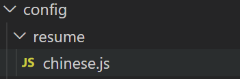
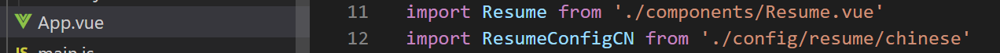
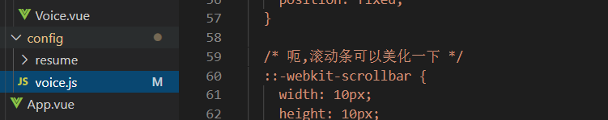
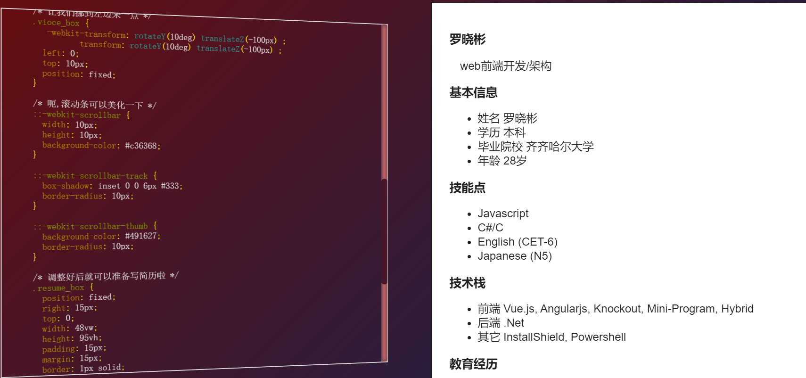

## 概要

普通な履歴書はPDFでのプレーンな文書ですので、あまり面白くありません。特に、あなたはFront-endディベロッパーですなら、アニメージョンフォーマットのダータを作成するようにすべきです。

そのため、私わ単純にアニメージョン履歴書を作成できるプラグインを追加します。
とれで、異なる言語の履歴書の作成することに対して新しいファイルを追加するだけできます。
とても簡単ですね。

## 使い方

中国語の履歴書を書けば、下記のChinese.jsを直接変更することいいです。

  

他の言語文書を追加することも非常にシンプルにできます。対応のファイルを作成して、Vue中に導入するだけ。使用方法はChinese.jsと同じです
(もしくは、Chiense.jsをコピーして、中身を書き換えて、ファイル名を変更します)。

  

なお、Voice.jsも修正可能です、別のCSSを使用できます。より詳細はソースコードを参照してください。

  

## デも

[簡単なデモ](https://zhulinbin.github.io/resume_github_page/)

  

ちなみに、個人利用で作成するため、Chromeが推奨します。別のブラウザでデストしません。
ブラウザでは表示する文書ですので、PDFファイルとして保存できます。だたし、今のバージョンのコードにこの機能が実装しません(すべてページを保存すべきではない、右側のテキストだけです)。

## Licence

[MIT](http://opensource.org/licenses/MIT)

Copyright (c) 2020-present, Luoxiaobin